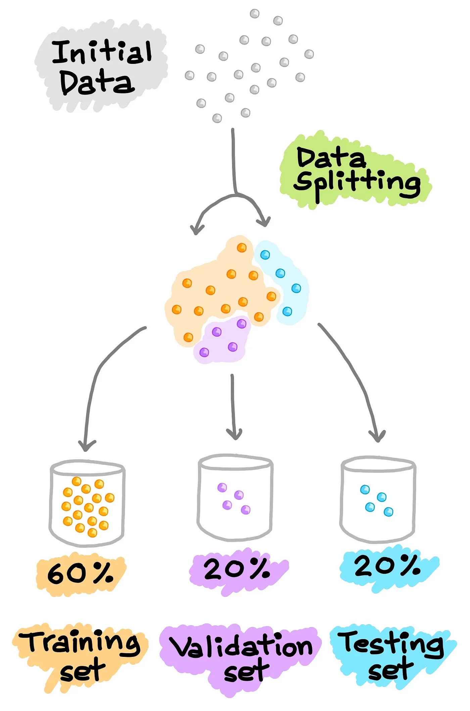

# 🧠 Diabetes Predictor (Machine Learning)

### 🛡️ Project Status & Context

| Status | Tech Stack | Type | Context |
| :--- | :--- | :--- | :--- |
| **Complete** | Python, Scikit-learn, Pandas | Predictive ML Model | **ISGA Academic Project** |

[](https://github.com/nveyounes/Diabetes-Predictor)
[](LICENSE)
[](https://github.com/nveyounes/Diabetes-Predictor)

---

## ⭐ Project Goal: Predicting Diabetes with ML

This repository contains a machine learning project developed for an academic report. The primary objective is to build and evaluate a predictive model that can determine the likelihood of a patient having diabetes based on specific medical features.

This project demonstrates the complete end-to-end machine learning workflow, from data cleaning and exploration to model training and evaluation.

### 📌 Key Concepts Demonstrated
* Data Preprocessing and Feature Engineering.
* Train-Test Data Splitting and Model Training.
* Model Evaluation using metrics like Accuracy, Precision, and Recall.
* Validation using a Confusion Matrix.

---

## 🛠️ Technology Stack

This analysis was conducted in a Jupyter Notebook using Python and its core data science libraries.

| Category | Technology | Purpose | Icon |
| :--- | :--- | :--- | :--- |
| **Language** | Python | Primary programming language. |  |
| **Environment** | Jupyter | Interactive notebook for analysis. |  |
| **Data** | Pandas | Data loading, manipulation, and cleaning. |  |
| **ML** | Scikit-learn | Model training and evaluation. |  |
| **Plotting** | Matplotlib | (Used for the confusion matrix). |  |

---

## 📂 Data & Workflow

The project follows a standard machine learning pipeline, which is detailed in the `machine_learning.ipynb` notebook.

### 1. The Dataset
The model is trained on the **Pima Indians Diabetes Dataset**. It includes 8 medical predictor variables (e.g., 'Pregnancies', 'Glucose', 'BloodPressure', 'BMI') and one target variable, 'Outcome' (0 for Non-Diabetic, 1 for Diabetic).

### 2. Model Training
* The data is loaded and cleaned using **Pandas**.
* The dataset is split into a **training set (80%)** and a **testing set (20%)**.
* A predictive model (such as Logistic Regression) is trained on the training data.

### 3. Model Evaluation
The model's performance is evaluated on the unseen test data using metrics like **Accuracy, Precision, and Recall**. The confusion matrix is used to visualize the model's performance in distinguishing between diabetic (1) and non-diabetic (0) patients.

---

## 📸 Project Visuals (Data & Results)

**Note:** For these images to appear, create an `img` folder in your repository and place `dataset.webp` and `validation.webp` inside it.

| Dataset Snapshot | Model Validation (Confusion Matrix) |
| :---: | :---: |
|  |  |

---

## 🚀 Getting Started

### Prerequisites
Make sure you have Python 3.x installed, along with the `pip` package manager.

### Installation

1.  **Clone the repository:**
    ```bash
    git clone [https://github.com/nveyounes/Diabetes-Predictor.git](https://github.com/nveyounes/Diabetes-Predictor.git)
    cd Diabetes-Predictor
    ```
2.  **Install the required Python libraries:**
    ```bash
    pip install jupyter pandas scikit-learn matplotlib seaborn
    ```

### Usage
To explore the analysis, run the Jupyter Notebook:

```bash
jupyter notebook machine_learning.ipynb
```
---

## 👥 Authors & Acknowledgements

This was an academic project for **ISGA (EDVANTIS Higher Education Group)**.

* **Younes Farhat**
* *(Feel free to add other authors here)*

### Supervised By:
* *(Feel free to add your supervisor's name here)*
